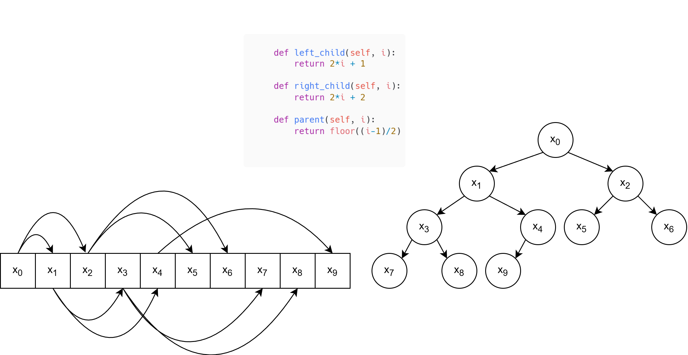

# Priority Queues – Overview

## Preface
Within this directory you will find a python implementation for priority queues which you can later on use to create your implementation. Additionally, the implementation of the priority queue in this directory will be different to the one you will create later on because the data structure you will be using is predefined and different to the one in here. Logically, it will be exactly the same.

The difference in the data structure is the following. The provided implementation represents the heap as an array instead of a binary tree. You can freely convert between the two representations using the digram below.

Please have a look into the implementation and try to solve the exercises with it. There is no need to solve all exercises if you already understand how priority queues work.

## Data Strucutre Description

A **priority queue** is an abstract data structure similar to a regular queue,  
but each element has a *priority*.  
Instead of strictly first in first out order, elements with higher priority are dequeued first.

## Key Properties
- Each element is associated with a **priority**. In our scenario the **value and the priority are equal**.
- Elements are removed based on their priority:
  - In a Max-Heap, the element with the highest priority value is removed first.
  - In a Min-Heap, the element with the lowest priority value is removed first.
- Implemented as a **binary heap** (here as a heap/array) stored in a tree-like structure.
- Maintains the **heap property**:
  - **Max-Heap**: Parent ≥ Children  
    - Used to implement a **Max-Priority-Queue**, where the element with the **highest priority value** is always at the root and is removed first.
  - **Min-Heap**: Parent ≤ Children  
    - Used to implement a **Min-Priority-Queue**, where the element with the **lowest priority value** is always at the root and is removed first.

## Core Functions

### 1. `insert(value)`
- Adds a new element with the given priority.

### 2. `extract_max()` / `extract_min()`
- Removes and returns the element with the **highest** priority.  

### 3. `increase_priority(element, new_priority)`
- Updates the priority of an existing element.

### 4. `heapify(i)`
- Ensures the **heap property** for the subtree rooted at a given node (or index `i` in an array-based heap).  
- Used after operations like `extract_max()` / `extract_min()` or during heap construction to keep the priority queue valid.

