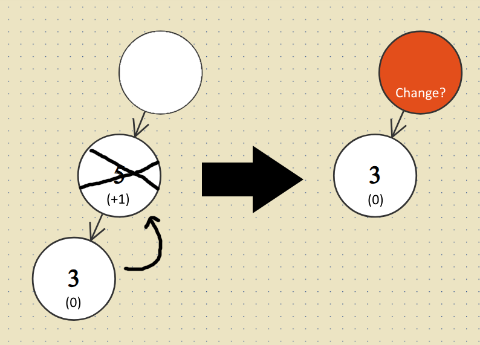
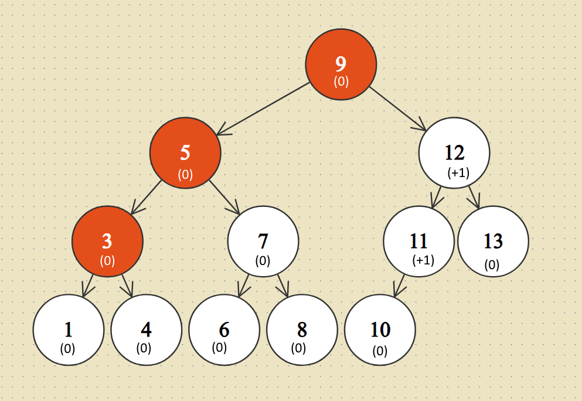

---
>-
  Here is a case where the node is replaced by its inorder successor. The first
  affected node is node **8**, since it has lost its left child. The only other
  nodes whose balance could have changed are the ancesors of **8**.

  
---

# AVL Delete Proposal

An idea on how one could implement AVL Deletion (_if there is no source for an algorithm already_).

## Algorithm

The first step is equivalent to deletion in binary search trees.

- If the node is a leaf, it is deleted.
- If a node has no right child, then it is replaced by its left child.
- If the node has a right child, then it is replaced by its inorder successor.

Next, one starts at the first affected node, whose balance was changed. Depending on the case it is either:

- The parent of the inorder successor if the node to be deleted was replaced by its inorder successor.
- The parent of the node to be deleted if it was a leaf or had no right child.

Here is how the different cases affect the nodes:

--------------------------------------------------------------------------------

Node **5** should be deleted. Therefore it is replaced by its inorder successor **7**. This directly changes the balance of **7**'parent, which is **8**. **8** now has a different balance value, since it has lost its left child. So in that case node **8** would be the first node, where the balance value changes. The only other changes could occur in the ancestors of **8**, so in **7** and **Blank**. Those all would have to be checked whether their balance changes.

--------------------------------------------------------------------------------

In the case where the deleted node **5** is replaced by its left child, the entire subtree shrinks by one node. The first affected node is the parent of the node to be deleted. In this case **Blank**.

--------------------------------------------------------------------------------

The same goes for when the deleted node **5** is a leaf. In that case the subtree also shrinks by one node and the first node to be affected is **Blank**.

--------------------------------------------------------------------------------

Now one has to start from the first affected parent, go up the tree until reaching the root and performing rebalancing whereever needed. Essentially it is the same as AVL-Insertion but where height is not increased but decreased instead.

## Example

--------------------------------------------------------------------------------

This is the initial state of the AVL tree.

--------------------------------------------------------------------------------

Next, node **2** was deleted and replaced by its inorder successor **3**. Node **4** is the first affected parent, since its balance value decreased by one given it lost its left child.

**4**'s balance is adjusted but it is in **[-1, +1]**, so no problem.

The value **3**, which replaced the deleted value **2** now also has a different balance value compared to what **2** used to have, since that subtree is no longer right-skewed. But tha value is also in **[-1, +1]**, so no problem.

But value **5** now has a balance value of -2, since it was at -1 before and the left subtree shrank by one node, resulting in the balance value of -2\. Now a rebalancing has to be performed.

--------------------------------------------------------------------------------

Node **9** becomes the root and node **5** becomes its left child. Now the balance is restored and no further adjustments are necessary.

